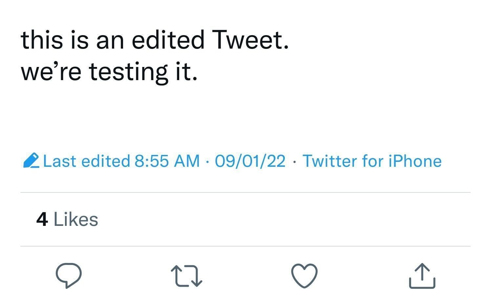
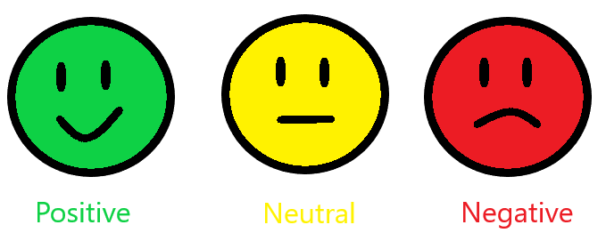

# Phase-Four-Project

# Classifying Positive and Negative Tweets

## Overview

This project analyses the text of tweets in order to understand whether people tweet more negative or positive information in order to further Twitter's marketing campaign towards the appropriate demographic. This project primarily uses NLTK and base python with models of the data.

## Business Problem

Twitter is inquiring whether the majority of their tweets are positive or negative. With this information they will be able to divert their traffic to different marketing areas. We will classify the text information into positive and negative and collect relavent aspects..

## Data Understanding
There are about 9,000 records collected from 'Data/tweet_product_company.csv'. The data includes information on emotion expressed in the tweet, the tweet itself and the device that the emotion is directed towards. In order to understand the data I found how many people are posting positive or negative tweets and how many words average each type of tweet. 

The most frequent words across the tweets in general are expressed in the visualization below: 

## EDA

In exploring the data it was found that 15% of people who expressed a negative emotion and 82% of people who expressed a positive emotion. 

With SMOTE applied to address the imbalance within the data.

There are about the same number of words used for negative and positive tweets (N=19, P=18), however the distribution slightly differed.

## Modeling
After instationating Logistic regression,  Support Vector Machines, Stochastic Gradient Descent, Random Forest, Naive Bayes, K-Nearest Neighbors, and the highest recall was recorded with Random Forest. 

## Hypertuning

Three types of models were used for hypertuning Stochastic Gradient Descent, Logistic Regression, and Random Forest. The Random Forest was still the highest model after hypertuning as it was before hypertuning as depicted in the model comparison figure below. 

The ROC curve below displays all 3 hypertuned models compared to a baseline logistic regression model. 

## Creating New Data to Best Model
In order to test exactly which aspects are effecting churn, new data sets were copied from the original and then altered in regards to the the two most significant features, total day minutes and total day charged.

The total day minutes was decreased by a standard deviation to understand whether lessening the total day minutes on the phone could lessen churn. 
Utilizing the Random Forest hypertuned model, which had the highest recall, on the new data it produced a training set accuracy of 1 and a test set accuracy of .948, greatly supporting this model and the importance of this feature in terms of churn.

For the second new data set, the total day minutes was one standard deviation less from the original data, the same as the first new dataset, and also the column total day charged was dropped due to potential collinearity because both features had the same amount of correlation to churn. TFor the second manipuated copied data, we kept the one standard deviation lessened total day minutes, but we also dropped total day charge from the data set because of the potential for collinearity. It did not improve the training set with 1 and the test set slightly worsebed to .712.

## Recommendations
-Shorter phone calls may lead to higher retention rates.
-Whether daily or hourly, how payment is collected will effect churn as well. Changing the method from daily to hourly could discourage churn.

## Next Steps
-Utilizing multi class classification for a ‘neutral’ emotion, however more neutral data would be needed.
-Attempt to code correctly sarcastic or ironic tweets
-Utilizing other vectorizers other than countvectorizer such as tfidfvectorizer.
-Hypertuning other models 

# For More Information
See the full analysis in the [Jupyter Notebook](https://github.com/rabrya0072/Phase_3_project/blob/main/Phase%203%20project.ipynb) or [presentation](https://github.com/rabrya0072/Phase_3_project/blob/main/presentation.pdf.pdf)) in this repository.

For additional info, contact Rachael Bryant at Rachaelbryant@flatironschool.com
# Repository Structure
├── code
│   ├── __init__.py
│   ├── data_preparation.py
│   ├── visualizations.py
├── data
├── images
├── README.md
├── presentation.pdf
└── Phase_3_project.ipynb

